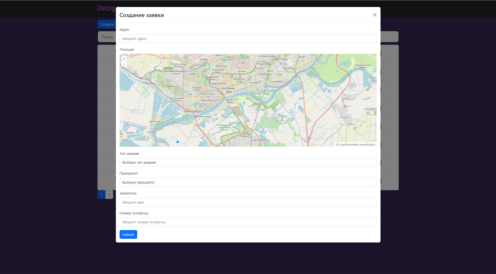

# Getting Started with Create React App

### `npm start`

Runs the app in the development mode.\
Open [http://localhost:8080](http://localhost:3000) to view it in your browser.
https://open-code-front.vercel.app/

### Технологии:
1) React
2) React-Router-dom v6
3) ReduxToolkit
4) BootstrapUI
5) Sass
6) OpenLayers

### Пути:
1) / - (Главная страница / ErrorPage)
2) /statement - Журнал
3) /statement/:id - Модальное окно редактирвоания записи
4) /statement/add - Модальное окно для добавления записи в журнал
5) /map - Карта
6) /map/:x/:y/:zoom - Карта с нужными координатами

### Проект:
Главное меню

 # Журнал

 # Создание записи

 # Редактирование записи

 # Карта (при наведение появляется popup)

### Подробнее:
1) Пагинация натсроена на 8 записей, после 8 записи появляется следющая страница
2) Записи хранятся в localStorage, также при редактировании также изменются внутри нее
3) На карте в зависимости от приоритета разный цвет у заявок. 
 - Оранжевый - Незамедлительно
 - Красный - Высокий
 - Синий - Средний
 - Зеленый - Низкий
4) Карта по дефолту отображает Ростов-на-Дону, зум 12
5) Поиск производится по введеному адресу
